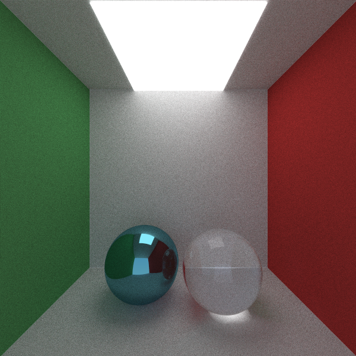

# RayTracing

A ray tracing engine for rendering photorealistic 3D scenes.
This project demonstrates techniques in computer graphics such as light reflection, refraction, shadows, and more.
It follows the implementation described in [Ray Tracing in One Weekend](https://raytracing.github.io/books/RayTracingInOneWeekend.html), while also adding some extra features and improvements.

---

## **Table of Contents**

1. [Features](#features)
2. [Examples](#examples)
3. [Installation](#installation)
4. [Usage](#usage)
5. [Acknowledgments](#acknowledgments)

---

## **Features**

- **Realistic Lighting**: Support for reflection, refraction, total internal reflection, shadows, and light sources.
- **Materials**: Customizable materials with adjustable properties like transparency and color.
- **Shapes**: Render spheres, planes, and triangles.
- **Multi-threading**: Optimized performance for multi-core processors.
- **Output**: Save renders as PNG or PPM images.

---

## **Examples**

Here are some images rendered with this ray tracer:

- **Cornell Box Scene**  
  

- **Glass, Metal Spheres with Reflection and Refraction**  
  

Find more examples in the `renders/` folder.

---

## **Installation**

1. Clone the repository:
   ```bash
   git clone https://github.com/VarunVF/RayTracing.git
   ```
2. Navigate to the project directory:
   ```bash
   cd RayTracing
   ```

---

## **Usage**

Include utilities, and the objects and materials you want to use:
```cpp
// Required
#include "Camera/Camera.hpp"
#include "HittableList/HittableList.hpp"

// Object types, as desired
#include "Hittable/Sphere.hpp"

// Materials, as desired
#include "Material/Lambertian.hpp"
#include "Material/Metal.hpp"
#include "Material/Dielectric.hpp"
#include "Material/DiffuseLight.hpp"
```

Define a camera:
```cpp
Camera camera;
camera.aspect_ratio      = 16.0 / 9.0;
camera.image_width       = 400;
camera.samples_per_pixel = 50;
camera.max_depth         = 50;
```

Define the objects in the scene and their materials:
```cpp
// Diffuse light material
auto light_material = std::make_shared<DiffuseLight>(
	Color3(0.84, 0.735, 1.7)
);

// Create a sphere using the material
auto light_source = std::make_shared<Sphere>(
	Point3(-0.5, 0, -1), 0.4, light_material
);
```

Add objects to the world (a HittableList):
```cpp
HittableList world;
world.add(light_source);
```

Render the scene:
```cpp
camera.renderPNGParallel(world, "render.png");
```

---

## **Acknowledgments**

- Inspiration: [Ray Tracing in One Weekend](https://raytracing.github.io/books/RayTracingInOneWeekend.html)
- Tools: zlib and libpng for outputting renders to PNG files.
- Special thanks to the graphics community for their tutorials and resources.

---
